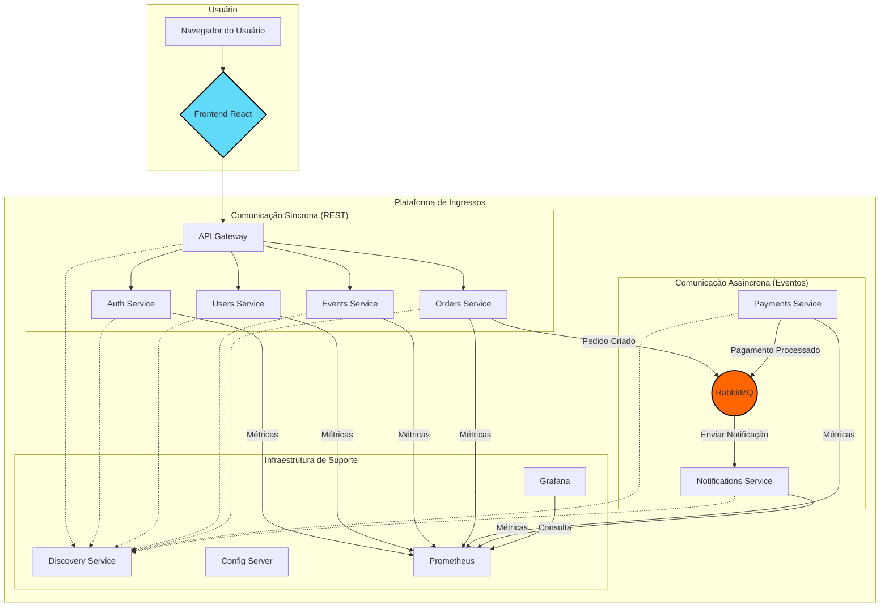
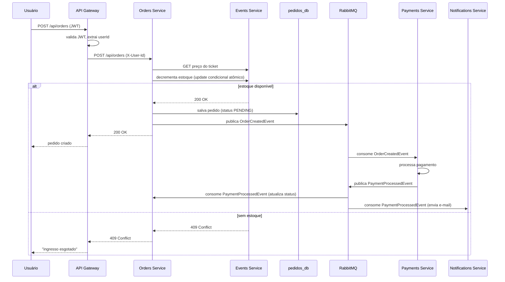

# Ticket System

Plataforma de venda de ingressos em arquitetura de microsserviços, construída com Java, Spring Boot e Spring Cloud.


**Stack:** Java 17 · Spring Boot 3.1.5 · Spring Cloud 2022.0.4 · PostgreSQL · RabbitMQ · Flyway · Resilience4j · Docker Compose · Prometheus · Grafana · React 18

## Arquitetura

O sistema é desacoplado em serviços independentes, cada um com um banco de dados próprio, que se comunicam de forma síncrona (REST via Feign, atrás de um API Gateway) e assíncrona (RabbitMQ). Service discovery via Eureka, configuração centralizada via Spring Cloud Config.



## Como rodar

Pré-requisitos: Docker + Docker Compose, Java 17 e Maven (para build local sem container).

```bash
git clone https://github.com/guilhermeariza/ticket-system.git
cd ticket-system
mvn -q clean install -DskipTests
docker compose up --build -d
```

Aguarde 1-2 minutos para todos os serviços Spring Boot subirem e se registrarem no Eureka (`docker compose ps` deve mostrar todos os serviços como `healthy`/`running`).

| Serviço | Porta | Swagger UI |
|---|---|---|
| Frontend (React) | 3000 | — |
| API Gateway | 8080 | — |
| Discovery Service (Eureka) | 8761 | — |
| Config Server | 8888 | — |
| Auth Service | 8081 | `/swagger-ui.html` |
| Users Service | 8082 | `/swagger-ui.html` |
| Events Service | 8083 | `/swagger-ui.html` |
| Orders Service | 8084 | `/swagger-ui.html` |
| Payments Service | 8085 | `/swagger-ui.html` |
| Notifications Service | 8086 | — |
| RabbitMQ Management | 15672 | — |
| Prometheus | 9090 | — |
| Grafana | 3001 | — |

Credenciais de exemplo (ambiente local, ver [`.env.example`](./.env.example)): Postgres `user`/`password`, RabbitMQ `guest`/`guest`, Grafana `admin`/`password`.

## Fluxo principal: compra de ingresso



## Decisões de arquitetura

- **Um banco por serviço** (`auth_db`, `users_db`, `eventos_db`, `pedidos_db`, `payments_db`): isola falhas e migrações entre serviços, ao custo de não ter transações distribuídas nativas — daí a necessidade de compensação explícita na compra de ingresso (ver abaixo).
- **RabbitMQ entre pedidos e pagamentos**, em vez de chamada síncrona: o processamento de pagamento pode ser lento ou instável; desacoplar via fila evita que o serviço de pedidos fique bloqueado ou falhe em cascata quando pagamentos está degradado.
- **Circuit breaker (Resilience4j) na chamada síncrona a events-service**: essa é a única chamada síncrona crítica no caminho de criação de pedido; sem breaker, uma degradação no events-service derrubaria o orders-service junto.
- **Update condicional atômico no decremento de estoque**, em vez de "ler quantidade, decidir, salvar": é a única forma de evitar overselling sob concorrência sem lock pessimista (ver seção dedicada abaixo).
- **JWT validado no API Gateway, não em cada serviço**: centraliza a lógica de autenticação; os serviços de backend recebem apenas `X-User-Id` e nunca o objeto `User` completo, reduzindo acoplamento.
- **Flyway em vez de `ddl-auto: update`**: schema versionado e auditável é obrigatório para qualquer serviço com dados reais; `ddl-auto` fica restrito a ambiente local de desenvolvimento rápido.

## Controle de concorrência na venda de ingressos

**O problema.** O fluxo original de compra fazia duas chamadas separadas ao serviço de eventos: uma para consultar a quantidade disponível (`GET .../available-quantity`) e, se suficiente, outra para decrementar (`PUT .../decrement-quantity`). Cada uma dessas chamadas, no lado do `events-service`, fazia `findById` → alterar em memória → `save`. Duas requisições concorrentes para o último ingresso disponível liam o mesmo valor, ambas viam estoque suficiente, e ambas decrementavam — resultando em overselling.

**A correção.** O decremento deixou de ser "ler depois escrever" e passou a ser um único `UPDATE` condicional no banco:

```sql
UPDATE ticket_types
SET available_quantity = available_quantity - :quantity
WHERE id = :id AND available_quantity >= :quantity
```

Esse update é atômico no nível do banco de dados: sob concorrência, apenas as requisições cuja condição `available_quantity >= quantity` ainda for verdadeira no momento da execução conseguem afetar uma linha; as demais recebem `0` linhas afetadas e o serviço responde `409 Conflict`. A checagem de disponibilidade deixou de existir como uma chamada separada — o próprio decremento *é* a checagem. Um campo `@Version` foi adicionado a `TicketType` para proteger as demais escritas da entidade (ex.: atualização de preço) de perdas por concorrência.

Como a reserva de estoque acontece antes da confirmação do pedido, uma falha depois do decremento (erro ao salvar o pedido, ou ao publicar na fila) aciona uma **compensação best-effort**: o `orders-service` chama um endpoint de liberação (`POST /events/ticket-types/{id}/release`) para devolver o estoque reservado, registrando erro em log se a própria liberação falhar. Isso não é uma saga completa — não há outbox nem retry garantido da compensação — mas cobre o caso comum sem introduzir a complexidade de um mecanismo transacional distribuído.

Um teste de integração (`TicketConcurrencyIntegrationTest`, em `events-service`) prova a correção: 20 threads disputando 1 único ingresso disponível resultam em exatamente 1 sucesso e 19 falhas por `InsufficientTicketsException`, com o estoque final em zero.

## Limitações conhecidas

- A compensação de estoque descrita acima é *best effort* (best-effort release + log), não uma saga completa com outbox transacional — em falhas simultâneas de rede na liberação, o estoque pode ficar reservado indevidamente até correção manual.
- Autenticação via JWT sem refresh token: o token expira e exige novo login, sem renovação silenciosa.
- Não há rate limiting no API Gateway.
- Cobertura de testes é desigual entre módulos — `servico-eventos` e `servico-pedidos` têm testes de integração e concorrência; outros serviços têm cobertura menor.

## Desenvolvimento assistido por IA

Este projeto foi construído com uma especificação escrita previamente, agentes de codificação (Claude Code) para a implementação, e revisão humana com testes automatizados como critério de aceite — não como formalidade. As diretrizes de arquitetura e convenções do repositório para agentes de IA estão em [`CLAUDE.md`](./CLAUDE.md).
