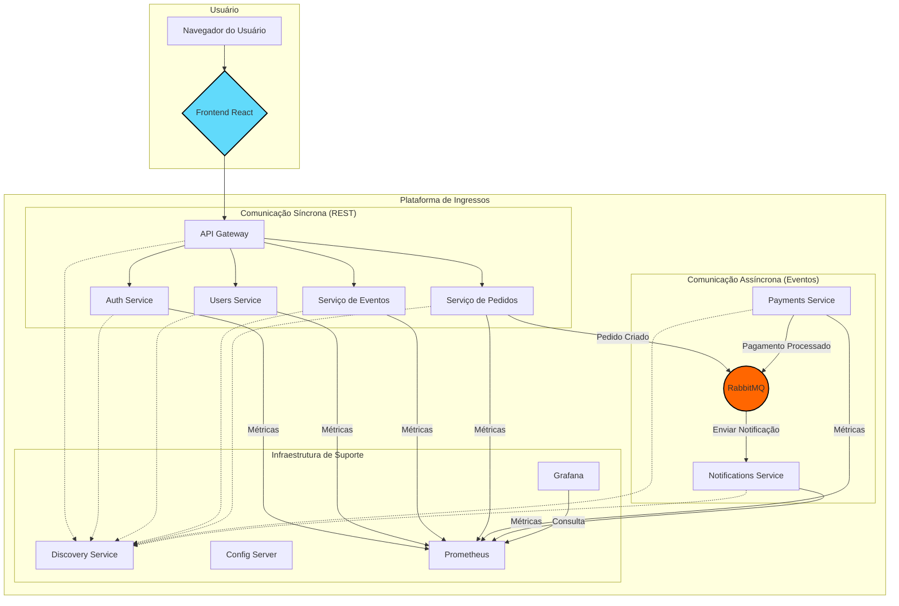

# Sistema de Venda de Ingressos - Arquitetura de Microsserviços

Este projeto implementa um sistema de venda de ingressos utilizando uma arquitetura de microsserviços com Java, Spring Boot e React.

## Visão Geral da Arquitetura

O sistema é desacoplado em serviços independentes, cada um com uma responsabilidade única, que se comunicam de forma síncrona (via APIs REST) e assíncrona (via mensageria com RabbitMQ). A infraestrutura de nuvem é simulada com Spring Cloud (Gateway, Eureka) e o ambiente é totalmente containerizado com Docker.

### Diagrama de Componentes

Este diagrama mostra a relação entre os principais componentes da arquitetura.



### Diagrama de Caso de Uso Principal

Este diagrama ilustra as principais ações que um usuário pode realizar no sistema.

```mermaid
left to right direction
actor Usuário

rectangle "Sistema de Ingressos" {
  Usuário -- (Registrar-se)
  Usuário -- (Fazer Login)
  Usuário -- (Buscar Eventos)
  Usuário -- (Ver Detalhes do Evento)
  Usuário -- (Comprar Ingresso)
  (Comprar Ingresso) .> (Processar Pagamento) : include
  (Comprar Ingresso) .> (Enviar Confirmação) : include
  Usuário -- (Ver Histórico de Pedidos)
}
```

## Documentação dos Microsserviços

Abaixo estão os links para a documentação detalhada de cada microsserviço, incluindo suas responsabilidades, APIs e diagramas de sequência e classe.

- **Infraestrutura:**
  - [`discovery-service`](./discovery-service/README.md)
  - [`config-server`](./config-server/README.md)
  - [`api-gateway`](./api-gateway/README.md)

- **Serviços de Backend:**
  - [`auth-service`](./auth-service/README.md)
  - [`users-service`](./users-service/README.md)
  - [`servico-eventos`](./servico-eventos/README.md)
  - [`servico-pedidos`](./servico-pedidos/README.md)
  - [`payments-service`](./payments-service/README.md)
  - [`notifications-service`](./notifications-service/README.md)

- **Frontend:**
  - [`frontend`](./frontend/README.md)

## Pré-requisitos

- [Docker](https://www.docker.com/get-started)
- [Docker Compose](https://docs.docker.com/compose/install/)
- [Java 17](https://www.oracle.com/java/technologies/javase/jdk17-archive-downloads.html)
- [Maven](https://maven.apache.org/install.html)

## Como Executar o Projeto

1. **Construir os Microsserviços Java:**
   ```bash
   mvn clean install
   ```

2. **Construir e Iniciar os Containers:**
   ```bash
   docker-compose up --build -d
   ```

## Acessando os Serviços

- **API Gateway:** [http://localhost:8080](http://localhost:8080)
- **Discovery Service (Eureka):** [http://localhost:8761](http://localhost:8761)
- **RabbitMQ Management:** [http://localhost:15672](http://localhost:15672) (login: guest/guest)
- **Frontend (React App):** [http://localhost:3000](http://localhost:3000)
- **Prometheus:** [http://localhost:9090](http://localhost:9090)
- **Grafana:** [http://localhost:3001](http://localhost:3001) (login: admin/password)