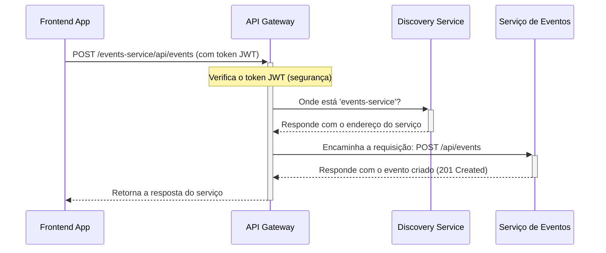

# API Gateway

Este serviço utiliza o **Spring Cloud Gateway** e atua como o ponto de entrada único (Single Point of Entry) para todas as requisições externas destinadas ao nosso sistema de microsserviços.

## Responsabilidades

O API Gateway é uma peça fundamental da arquitetura, abstraindo a complexidade da comunicação interna e fornecendo uma fachada unificada para os clientes (como a aplicação frontend).

- **Roteamento Inteligente:** Encaminha as requisições recebidas para o microsserviço apropriado. Ele se integra com o **Discovery Service (Eureka)** para encontrar dinamicamente a localização dos serviços.
- **Segurança Centralizada:** Pode ser usado para centralizar a lógica de autenticação e autorização, verificando tokens JWT antes de encaminhar a requisição.
- **Load Balancing:** Distribui a carga entre múltiplas instâncias de um mesmo serviço.
- **Rate Limiting:** Protege os serviços de backend contra sobrecarga, limitando o número de requisições por cliente.
- **CORS:** Gerencia a configuração de Cross-Origin Resource Sharing (CORS) em um único local.

## Diagrama de Sequência: Roteamento de Requisição

Este diagrama mostra como o API Gateway processa uma requisição do frontend para criar um novo evento.

