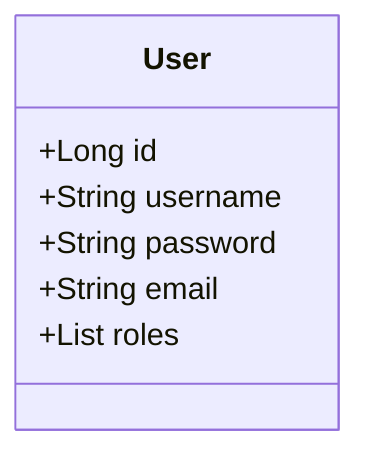

# Auth Service

Este serviço é responsável pela **autenticação e autorização** de usuários no sistema. Ele utiliza Spring Security para gerenciar o processo.

## Responsabilidades

- **Registro de Usuários:** Expõe um endpoint para que novos usuários possam se registrar no sistema.
- **Autenticação:** Valida as credenciais (usuário e senha) de um usuário e, se forem válidas, gera um **Token JWT (JSON Web Token)**.
- **Geração de Token:** O token JWT contém informações sobre o usuário (como ID e roles) e é assinado digitalmente para garantir sua integridade.
- **Validação de Token:** (Opcional, pode ser centralizado no API Gateway) Expõe um endpoint para validar um token JWT.

## Diagrama de Classe

O modelo de dados principal para este serviço é a entidade `User`.



## Diagrama de Sequência: Fluxo de Login

Este diagrama ilustra o processo de autenticação de um usuário e a obtenção de um token JWT.

```mermaid
sequenceDiagram
    participant U as Usuário
    participant FE as Frontend App
    participant GW as API Gateway
    participant AS as Auth Service
    participant DB as Auth DB

    U->>FE: Preenche formulário de login (usuário, senha)
    FE->>+GW: POST /auth-service/api/auth/login
    GW->>+AS: Encaminha requisição
    AS->>+DB: Busca usuário por 'username'
    DB-->>-AS: Retorna dados do usuário (incluindo hash da senha)
    Note over AS: Compara o hash da senha do DB com a senha enviada
    alt Credenciais Válidas
        AS->>AS: Gera Token JWT
        AS-->>-GW: Responde com o Token JWT
        GW-->>-FE: Retorna Token JWT
        FE->>U: Armazena o token e redireciona para a área logada
    else Credenciais Inválidas
        AS-->>-GW: Responde com erro 401 Unauthorized
        GW-->>-FE: Retorna erro 401
        FE->>U: Exibe mensagem de erro
    end
```
