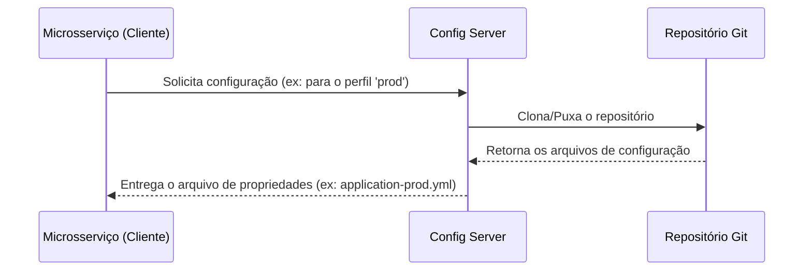

# Config Server

Este serviço utiliza o **Spring Cloud Config Server** para fornecer gerenciamento centralizado de configurações para todos os outros microsserviços.

## Responsabilidade

A principal responsabilidade do Config Server é externalizar as configurações dos microsserviços, permitindo que elas sejam gerenciadas em um local central, sem a necessidade de reconstruir ou reimplantar os serviços para alterar uma configuração.

- **Centralização:** Armazena as configurações de todos os ambientes (desenvolvimento, produção, etc.) em um repositório Git.
- **Dinamismo:** Os microsserviços clientes consultam o Config Server na inicialização para obter suas configurações. É possível até mesmo atualizar configurações em tempo de execução sem reiniciar os serviços (requer Spring Cloud Bus).
- **Segurança:** Permite criptografar propriedades sensíveis (como senhas de banco de dados e chaves de API) no repositório Git.

## Como Funciona

O Config Server atua como uma ponte entre os microsserviços e um repositório Git que contém os arquivos de configuração.

