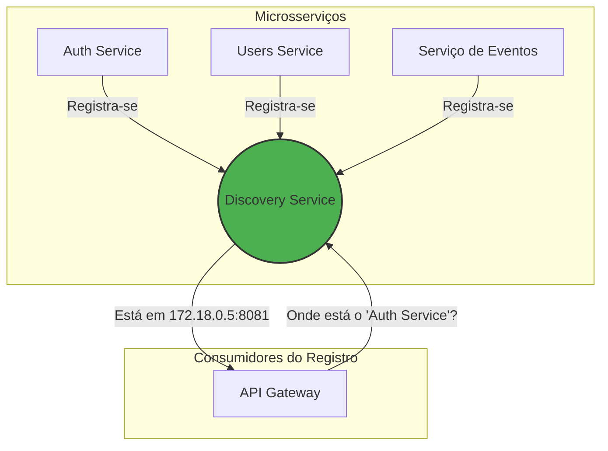

# Discovery Service (Eureka)

Este serviço é o **Registro de Serviços** da nossa arquitetura de microsserviços. Ele utiliza o Netflix Eureka.

## Responsabilidade

A principal e única responsabilidade do Discovery Service é permitir que outros serviços se registrem e descubram uns aos outros dinamicamente na rede. Isso elimina a necessidade de hardcoding de endereços IP e portas, tornando a arquitetura mais resiliente e escalável.

- **Registro:** Cada microsserviço, ao iniciar, se registra no Eureka Server, informando seu nome, endereço e porta.
- **Descoberta:** Quando um serviço (como o API Gateway) precisa se comunicar com outro, ele consulta o Eureka para obter o endereço atual do serviço desejado.
- **Health Check:** O Eureka espera "batimentos cardíacos" (heartbeats) regulares de cada serviço registrado. Se um serviço para de enviar heartbeats, ele é removido do registro após um tempo, evitando que o tráfego seja enviado para instâncias indisponíveis.

## Como Funciona

