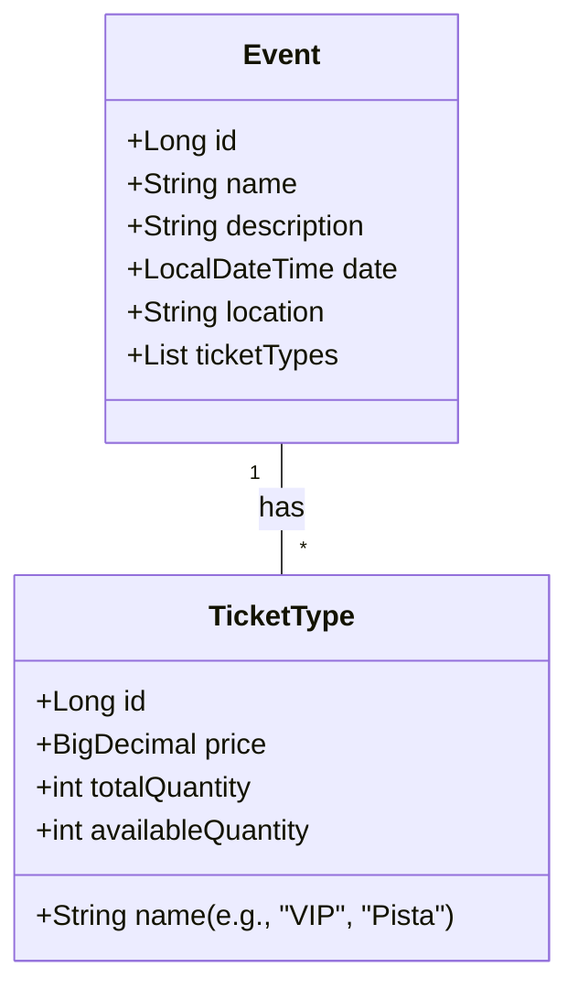
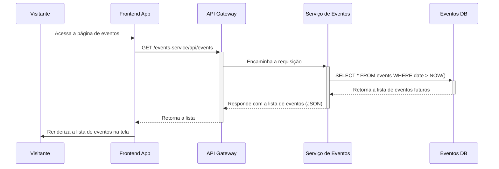

# Serviço de Eventos

Este serviço é o coração do negócio, responsável por gerenciar todos os aspectos relacionados a eventos e ingressos.

## Responsabilidades

- **CRUD de Eventos:** Permite a criação, leitura, atualização e exclusão de eventos.
- **Gerenciamento de Ingressos:** Controla os tipos de ingressos para cada evento, seus preços e a quantidade disponível.
- **Consulta Pública:** Expõe endpoints públicos para que os usuários possam listar eventos disponíveis e ver os detalhes de um evento específico.
- **Controle de Estoque:** Fornece mecanismos para consultar a disponibilidade de ingressos.

## Diagrama de Classe

As principais entidades são `Event` e `TicketType`, mostrando uma relação de um-para-muitos.

## Diagrama de Sequência: Listagem de Eventos

Este é um fluxo simples e público para qualquer visitante do site.

