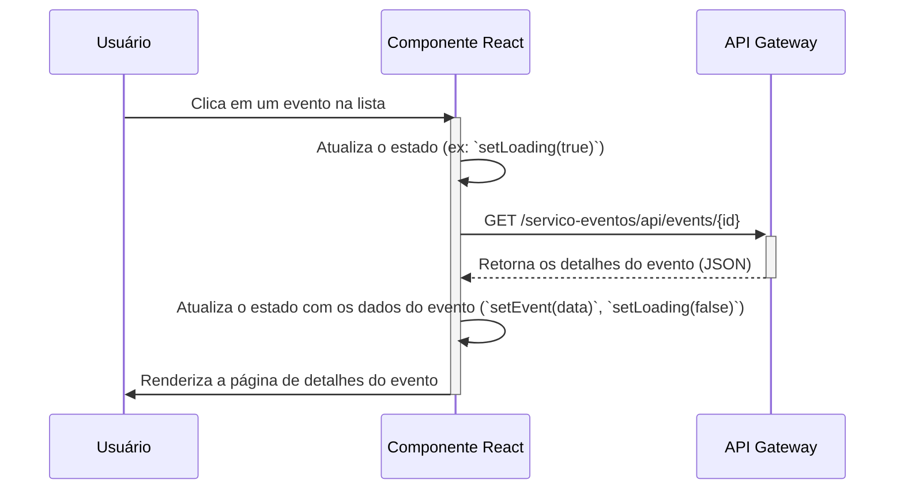

# Frontend (React SPA)

Esta é a aplicação Single Page Application (SPA) construída com React, que serve como a interface do usuário para o sistema de venda de ingressos.

## Responsabilidades

- **Interface do Usuário:** Fornecer uma experiência de usuário rica e interativa para todas as funcionalidades do sistema.
- **Comunicação com o Backend:** Todas as interações com os microsserviços são feitas através do **API Gateway**. O frontend não conhece e não deve conhecer os endereços dos serviços individuais.
- **Gerenciamento de Estado:** Controla o estado da interface, incluindo o estado de autenticação do usuário (gerenciamento de tokens JWT).

## Diagrama de Caso de Uso (Visão do Frontend)

Este diagrama foca nas interações diretas do usuário com a interface.

```mermaid
left to right direction
actor Usuário

rectangle "Aplicação React" {
  Usuário -- (Navegar entre páginas)
  Usuário -- (Preencher formulários)
  Usuário -- (Clicar em botões)
  Usuário -- (Ver modais e notificações)

  (Preencher formulários) ..> (Login, Registro, Compra)
  (Clicar em botões) ..> (Buscar, Salvar, Comprar)
}
```

## Fluxo de Dados: Exibindo Detalhes de um Evento


