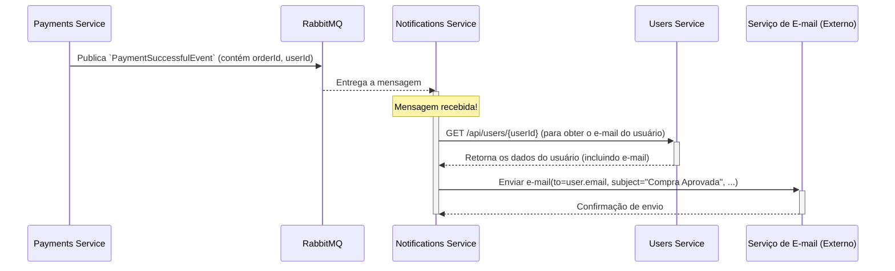

# Notifications Service

Este serviço é responsável por enviar notificações aos usuários em resposta a eventos que ocorrem no sistema.

## Responsabilidades

- **Consumo de Eventos:** É um serviço puramente orientado a eventos. Ele se inscreve em tópicos no RabbitMQ para ouvir mensagens sobre eventos importantes.
- **Envio de Notificações:** Ao receber uma mensagem, ele processa a informação e utiliza um serviço de terceiros para enviar a notificação (ex: e-mail via SendGrid, SMS via Twilio, ou push notification via Firebase).
- **Desacoplamento:** Ele não possui endpoints de API para serem chamados diretamente. Sua única fonte de trabalho são as mensagens na fila, o que o torna altamente desacoplado do resto do sistema.

## Diagrama de Sequência: Notificação de Compra Sucedida

Este diagrama mostra como o serviço de notificação reage a um evento de pagamento bem-sucedido para enviar um e-mail de confirmação ao usuário.

## Eventos Consumidos

Este serviço pode ouvir vários eventos, como:

- `PaymentSuccessfulEvent`: Para enviar a confirmação da compra e os ingressos.
- `PaymentFailedEvent`: Para notificar o usuário sobre a falha no pagamento.
- `EventReminderEvent`: Para enviar um lembrete um dia antes do evento.
- `EventCancelledEvent`: Para notificar os compradores sobre o cancelamento de um evento.
