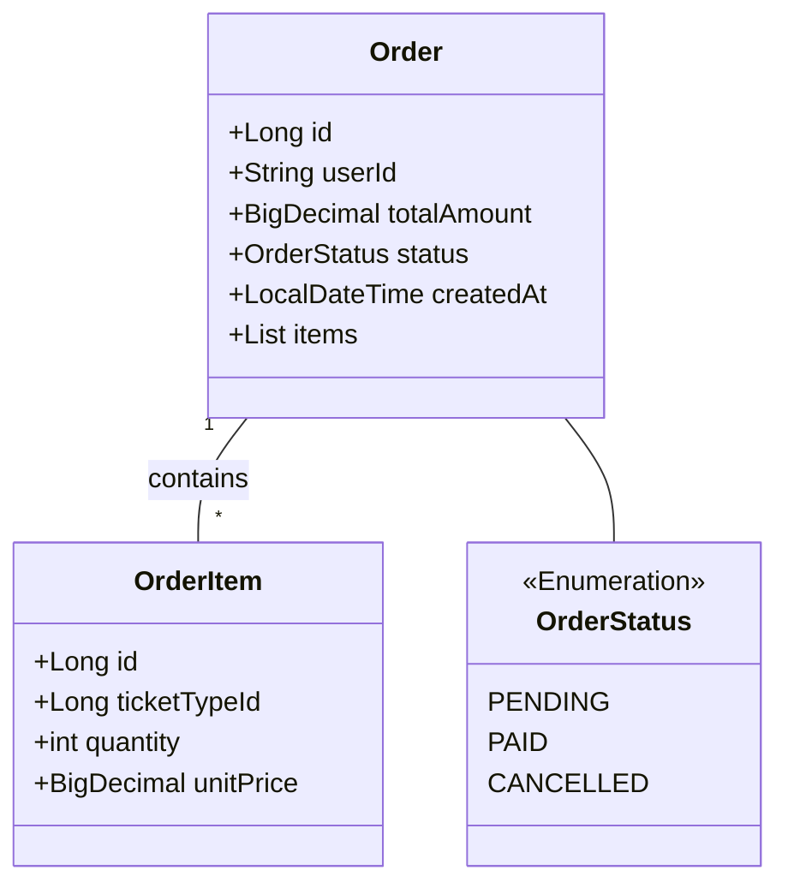
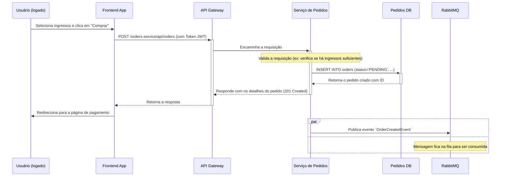

# Serviço de Pedidos

Este serviço gerencia o ciclo de vida de uma ordem de compra de ingressos.

## Responsabilidades

- **Criação de Pedidos:** Expõe um endpoint para que um usuário possa iniciar um processo de compra, criando um pedido com o status "PENDENTE".
- **Gerenciamento de Estado:** Controla o estado do pedido, que pode ser `PENDING`, `PAID`, `CANCELLED`, etc.
- **Comunicação Assíncrona:** Ao criar um pedido, publica um evento `OrderCreatedEvent` no RabbitMQ. Isso desacopla o fluxo de pagamento e notificação.
- **Consulta de Pedidos:** Permite que um usuário consulte seu histórico de pedidos.

## Diagrama de Classe

A entidade `Order` representa uma compra, contendo os itens do pedido.

## Diagrama de Sequência: Criação de Pedido

Este diagrama mostra a criação de um pedido e a publicação de um evento no RabbitMQ.

