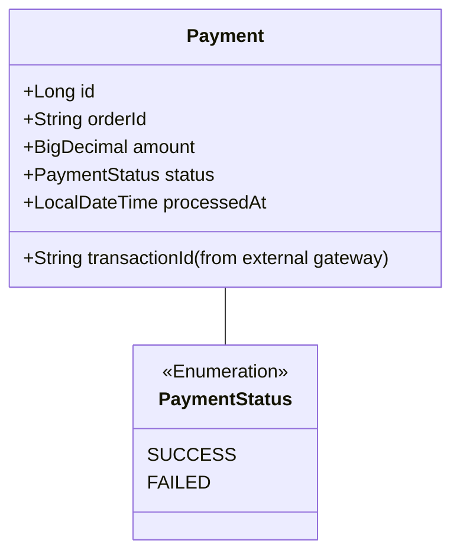

# Payments Service

Este serviço é responsável por processar os pagamentos dos pedidos.

## Responsabilidades

- **Processamento de Pagamentos:** Integra-se com um gateway de pagamento externo (ex: Stripe, PayPal) para processar a transação financeira.
- **Atualização de Status:** Ouve eventos de `OrderCreatedEvent` do RabbitMQ para saber quais pedidos estão aguardando pagamento.
- **Comunicação Assíncrona:** Após um pagamento ser processado (com sucesso ou falha), publica um evento `PaymentProcessedEvent` no RabbitMQ para que outros serviços (como o de notificação) possam reagir.

## Diagrama de Classe

A entidade `Payment` registra os detalhes de cada transação.



## Diagrama de Sequência: Processamento de Pagamento

Este fluxo é iniciado quando o usuário submete suas informações de pagamento.

```mermaid
sequenceDiagram
    participant U as Usuário
    participant FE as Frontend App
    participant GW as API Gateway
    participant PS as Payments Service
    participant Ext as Gateway de Pagamento Externo
    participant MQ as RabbitMQ

    U->>FE: Insere dados do cartão e finaliza a compra
    FE->>+GW: POST /payments-service/api/payments
    GW->>+PS: Encaminha requisição com dados do pagamento
    PS->>+Ext: Processar pagamento(amount, card_details)
    Ext-->>-PS: Retorna resultado (sucesso/falha)

    alt Pagamento com Sucesso
        PS->>PS: Salva o pagamento no DB com status 'SUCCESS'
        PS->>MQ: Publica evento `PaymentSuccessfulEvent`
        PS-->>-GW: Responde com sucesso (200 OK)
        GW-->>-FE: Retorna sucesso
        FE->>U: Mostra página de confirmação
    else Pagamento com Falha
        PS->>PS: Salva o pagamento no DB com status 'FAILED'
        PS->>MQ: Publica evento `PaymentFailedEvent`
        PS-->>-GW: Responde com erro (400 Bad Request)
        GW-->>-FE: Retorna erro
        FE->>U: Mostra mensagem de erro no pagamento
    end
```
