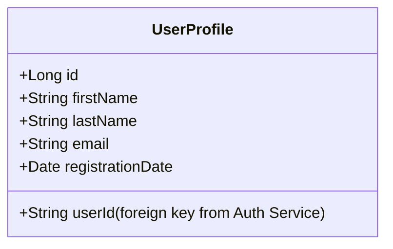
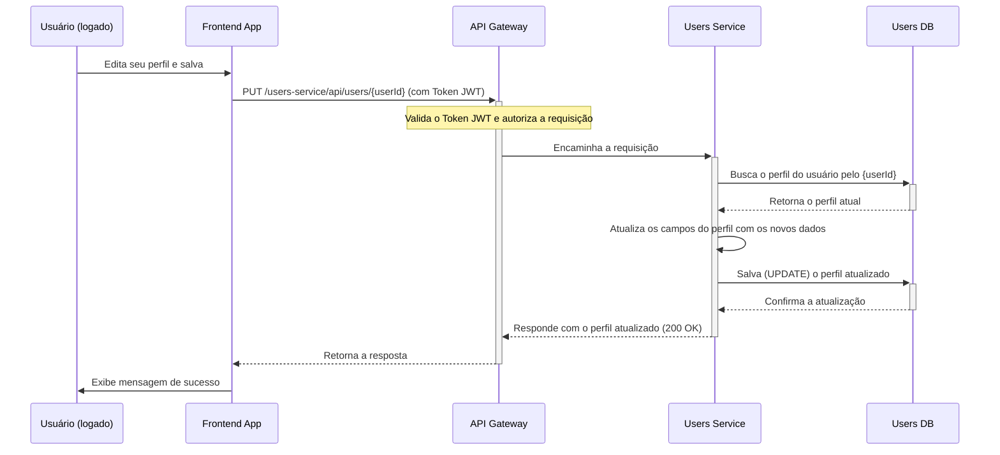

# Users Service

Este serviço é responsável pelo gerenciamento completo dos dados dos usuários (CRUD - Create, Read, Update, Delete).

## Responsabilidades

- **CRUD de Usuários:** Fornece endpoints para criar, ler, atualizar e deletar perfis de usuários.
- **Gerenciamento de Perfil:** Permite que os usuários atualizem suas próprias informações, como nome, e-mail, etc.
- **Consulta de Dados:** Permite que outros serviços consultem informações de usuários por ID.

## Diagrama de Classe

A entidade principal é a `UserProfile`, que contém informações públicas e semi-públicas do usuário.

## Diagrama de Sequência: Atualização de Perfil

Este diagrama mostra o fluxo para um usuário atualizar suas informações de perfil.

